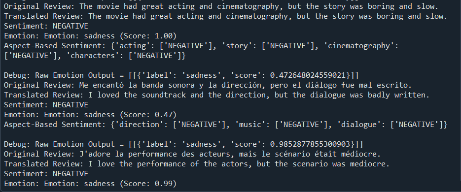

<h1 align="center" id="title">Sentiment Analysis Using IMDb Reviews</h1>
[](https://github.com/ChandanDev27/Sentiment-Analysis-Using-IMDb-Reviews)


<p id="description">This project is all about analyzing IMDb movie reviews to understand the emotions and sentiments hidden in them. Using advanced machine learning techniques particularaly a BiLSTM neural network we’ve developed a model that doesn’t just classify reviews as positive or negative but also digs deeper into specific aspects like acting music and storytelling.</p>

<p align="left">  </p>

<h2>Project Screenshots:</h2>




  
  
<h2>🧐 Features</h2>

Here are some of the project's best features:

*   Binary Sentiment Classification
*   Multilingual Sentiment Analysis
*   Aspect-Based Sentiment Analysis
*   Emotion Detection
*   Overfitting Prevention
*   Preprocessing Pipeline
*   Training and Validation Accuracy Visualization
*   Automated Review Analysis
*   Customer Feedback Insights
*   Aspect-Based Feedback

<h2>🛠️ Installation Steps:</h2>

<p>1. SpaCy (for text processing)</p>

```
pip install spacy python

-m spacy download en_core_web_sm
```

<p>2. TensorFlow (for building and training the BiLSTM Model)</p>

```
pip install tensorflow
```

<p>3. Google Translator API (for multilingual sentiment analysis)</p>

```
pip install googletrans==4.0.0-rc1
```

<p>4. Hugging Face Transformers (for emotion detection)</p>

```
pip install transformers
```

<p>5. Matplotlib (for data visualization)</p>

```
pip install matplotlib
```
